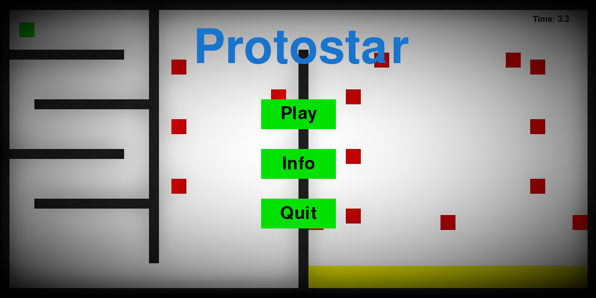
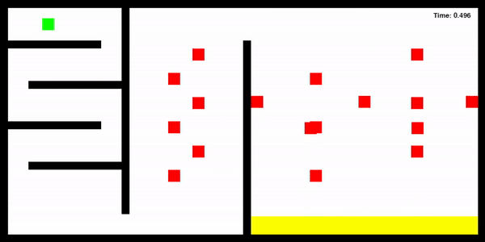

<h1 align="center"> 
Protostar 🌠
</h1>
<p align="center"> 
  
</p>
<h2>
  📝 About the project
</h2>
<p>
  This is my very first project working in Python focusing on object oriented programming. My inspiration for this game was <i>The World's Hardest Game</i> that I used to play when I was younger. This project implements multiple classes and functions to generate various screens and player-controlled cube which goal is to reach the end of the screen by dodging other objects on the way.
</p>
<h2>
  📷 Demo
</h2> 
<p align="center">
  
</p>
<h2>
  🔍 How it works
</h2>
<p>
  The project is written in Python using pygame library. In order to make the cubes move, they are not actually "moving" but the cubes are drawn on the screen in every frame on different positions and the result of that is the effect of moving. Most commonly used class for drawing all the objects is <b>Pygame.Rect</b>. 
</p>
<h2>
  📖 Getting Started
</h2>
<p>
  Requirements: Python and pygame (Python package)
</p>
<p>
  In order to start the program, you have to download the File <b>Protostar</b>. It is very important that the following files are all in the same directory: <b>protostar.py</b> and <b>Pictures</b>. The easiest method is just to download the File <b>Protostar</b>.
</p>
<h2>
  🔨 How to use
</h2>
<p>
  After executing the program you will see the main menu. Three buttons are featured in the main menu: 'Play', 'Info', and 'Quit'. 'Quit' button ends the program. 'Info' shows you the instructions how to play the game, and 'Play' button starts the game. The goal of the game is to reach the yellow rectangle. You are controlling green cube which you can move with the keyboard arrows in horizontal and vertical directions. You are not allowed to make a collision with any other object on the screen. Colliding with them will result in losing and you have to start over.
</p>

<h2>
  📄 License
</h2>

```
MIT License

Copyright (c) [2023] [Walther Trgovac]

Permission is hereby granted, free of charge, to any person obtaining a copy
of this software and associated documentation files (the "Software"), to deal
in the Software without restriction, including without limitation the rights
to use, copy, modify, merge, publish, distribute, sublicense, and/or sell
copies of the Software, and to permit persons to whom the Software is
furnished to do so, subject to the following conditions:

The above copyright notice and this permission notice shall be included in all
copies or substantial portions of the Software.

THE SOFTWARE IS PROVIDED "AS IS", WITHOUT WARRANTY OF ANY KIND, EXPRESS OR
IMPLIED, INCLUDING BUT NOT LIMITED TO THE WARRANTIES OF MERCHANTABILITY,
FITNESS FOR A PARTICULAR PURPOSE AND NONINFRINGEMENT. IN NO EVENT SHALL THE
AUTHORS OR COPYRIGHT HOLDERS BE LIABLE FOR ANY CLAIM, DAMAGES OR OTHER
LIABILITY, WHETHER IN AN ACTION OF CONTRACT, TORT OR OTHERWISE, ARISING FROM,
OUT OF OR IN CONNECTION WITH THE SOFTWARE OR THE USE OR OTHER DEALINGS IN THE
SOFTWARE.
```
